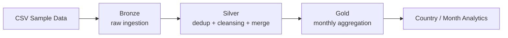
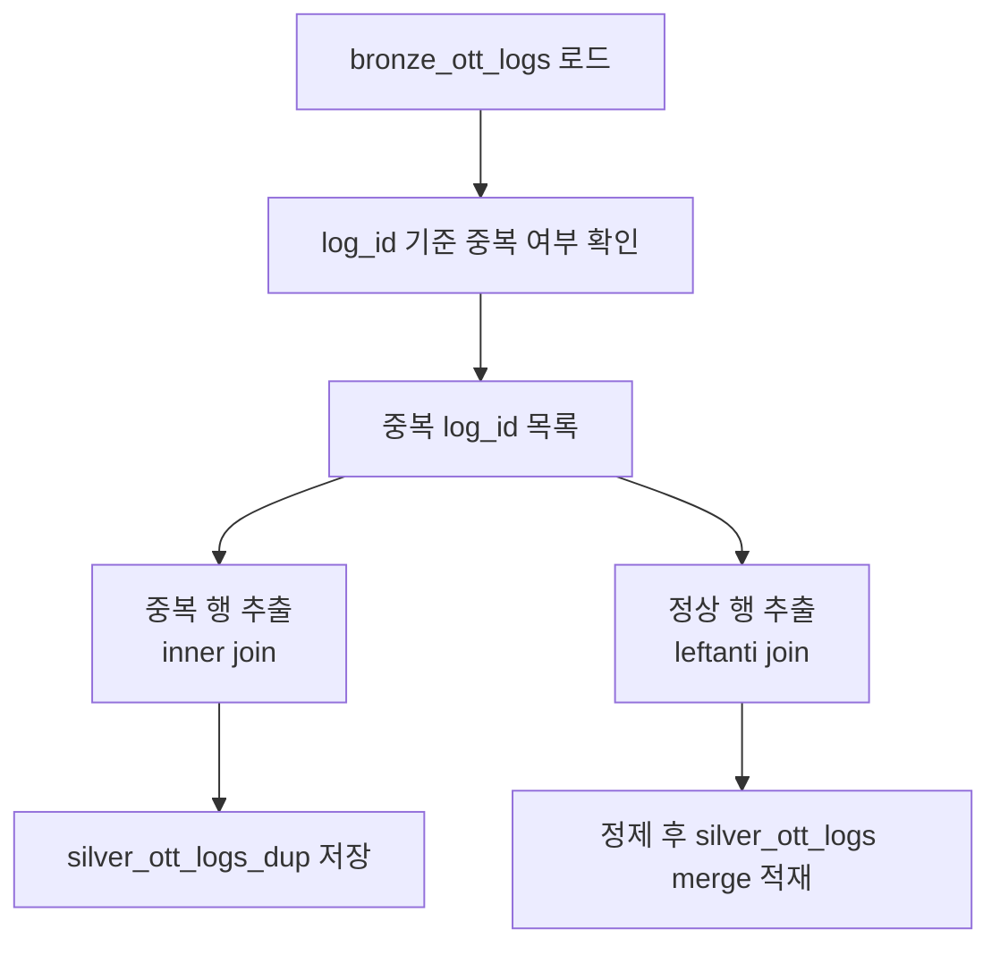

# Databricks 기반 OTT 데이터 파이프라인

Databricks에서 OTT 서비스 데이터를 `Bronze -> Silver -> Gold` 구조로 적재, 정제, 집계한 데이터 엔지니어링 프로젝트입니다.  
원본 CSV를 스키마 기반으로 안정적으로 적재하고, 중복 데이터 분리 처리와 `DeltaTable API` 기반 증분 적재를 적용해 분석 가능한 테이블을 구성했습니다.

## 한눈에 보기

- Databricks에서 OTT 원천 데이터를 `Bronze -> Silver -> Gold` 구조로 처리하는 파이프라인 구현
- Silver 적재 로직을 `SQL MERGE INTO`에서 `DeltaTable API + DataFrame merge`로 변경해 `22초 -> 4초` 개선
- 중복 데이터는 즉시 실패 처리하지 않고 `*_dup` 테이블로 분리해 후속 점검 가능한 구조로 설계

## 프로젝트 요약

- 목적: OTT 콘텐츠, 시청 로그, 사용자 데이터를 분석 가능한 형태로 가공
- 환경: Databricks Notebook, PySpark, Spark SQL, Delta Lake
- 핵심 구현:
  - Bronze 레이어에서 원본 CSV를 명시적 스키마로 적재
  - Silver 레이어에서 중복 분리, Null/공백 정제, Delta `merge` 적용
  - Gold 레이어에서 국가별 월간 시청 시간 및 장르 Top 3 집계

## 아키텍처



## 사용 기술 스택

| 항목 | 내용 |
|---|---|
| Platform | Databricks |
| Language | Python |
| Processing | PySpark, Spark SQL |
| Storage | Delta Lake, Delta Table |
| Architecture | Medallion Architecture |
| Version Control | Git, GitHub |

## 데이터 흐름

### 1. Bronze

- 원본 파일: `bronze_ott_contents.csv`, `bronze_ott_logs.csv`, `bronze_ott_users.csv`
- 처리 방식:
  - `inferSchema` 대신 명시적 스키마 지정
  - Databricks Volume 경로의 CSV를 읽어 Bronze 테이블로 저장
- 생성 테이블:
  - `bronze_ott_contents`
  - `bronze_ott_logs`
  - `bronze_ott_users`

### 2. Silver

- 처리 방식:
  - 키 기준 중복 데이터 식별
  - 정상 데이터와 중복 데이터를 분리 저장
  - 문자열 공백 제거, Null 보정
  - `DeltaTable API + DataFrame merge` 기반 증분 적재
- 생성 테이블:
  - `silver_ott_contents`
  - `silver_ott_logs`
  - `silver_ott_users`
  - `silver_ott_contents_dup`
  - `silver_ott_logs_dup`
  - `silver_ott_users_dup`

### 3. Gold

- 처리 방식:
  - 로그, 사용자, 콘텐츠 데이터를 조인
  - 국가별, 월별, 콘텐츠별 시청 시간 집계
  - 입력 월과 국가를 기준으로 장르 Top 3 산출
- 생성 테이블:
  - `gold_cnt_mon_content`
  - `silver_{country}_genre_{month_safe}_top3`  
    현재 Notebook에서는 월별/국가별 Top 3 결과를 파라미터 기반 파생 테이블로 저장합니다.

## 주요 성과

### 1. Silver 적재 성능 개선

- 비교 기준: Databricks Notebook 환경, 동일한 `100,500건` 로그 데이터셋
- 기존 방식: 임시뷰 생성 후 SQL `MERGE INTO`
- 개선 방식: `DeltaTable API + DataFrame merge`
- 동일 환경, 약 `100,500건` 기준 처리 시간 `22초 -> 4초`
- 약 `82%` 성능 개선 확인

이 과정을 통해 Spark/Delta 환경에서는 익숙한 SQL 패턴보다 플랫폼에 맞는 API를 선택하는 것이 더 효율적일 수 있음을 확인했습니다.

### 2. 중복 데이터 분리 처리

- 예제 데이터에서는 중복 로그가 발생하지 않았지만, 운영 환경에서는 동일 `log_id`가 유입될 수 있다고 가정해 예외 처리 흐름을 사전에 설계
- 중복 행은 `*_dup` 테이블로 저장하고 정상 데이터만 Silver 본 테이블에 적재
- 데이터 품질 이슈와 정상 적재 흐름을 분리해 후속 점검 가능한 구조로 설계

아래는 `log_id` 기준 로그 데이터 중복 분기 흐름입니다.



## 저장소 구성

현재 저장소는 Databricks Notebook 중심으로 구성되어 있습니다.

- `config.py`: 공통 경로, catalog/schema, 테이블명 설정
- `bronze_table.ipynb`: Bronze 적재
- `silver_table.ipynb`: Silver 정제 및 증분 적재
- `gold_table.ipynb`: Gold 집계
- `inv.zip`: 예제 CSV 데이터 압축 파일

## 설정 파일 안내

`config.py`에서 데이터 경로와 테이블명을 한 번에 관리합니다.  
실행 전에는 이 파일만 자신의 Databricks 환경에 맞게 수정하면 됩니다.

현재 `config.py`의 기본값은 실습 환경 예시이며, 실행 환경에 맞게 변경해야 합니다.

| 설정값 | 설명 |
|---|---|
| `CATALOG` | 사용할 Databricks catalog |
| `SCHEMA` | 사용할 schema |
| `VOLUME` | CSV 파일을 올려둘 volume 이름 |
| `DATA_DIR` | volume 내부 데이터 폴더명 |
| `BASE_VOLUME_PATH` | 원본 CSV를 읽는 기본 경로 |
| `BRONZE_*_TABLE` | Bronze 레이어 저장 테이블명 |
| `SILVER_*_TABLE` | Silver 레이어 저장 테이블명 |
| `SILVER_*_DUP_TABLE` | 중복 데이터 저장 테이블명 |
| `GOLD_MONTHLY_CONTENT_TABLE` | Gold 집계 테이블명 |

예시:

```python
CATALOG = "edu260323"
SCHEMA = "hjh"
VOLUME = "volume"
DATA_DIR = "inv"
```

## 실행 방법

이 프로젝트는 Databricks 환경에서 실행하는 것을 전제로 작성되었습니다.

### 1. 저장소 준비

- 이 저장소를 Databricks Repo 또는 Workspace Files에 업로드합니다.
- `config.py`와 각 Notebook이 같은 프로젝트 루트에 위치하도록 유지합니다.

### 2. 예제 데이터 준비

1. `inv.zip` 압축 해제
2. `bronze_ott_contents.csv`, `bronze_ott_logs.csv`, `bronze_ott_users.csv` 파일을 Databricks Volume에 업로드
3. 업로드 경로가 `config.py`의 `BASE_VOLUME_PATH`와 일치하는지 확인

예시 업로드 경로:

```text
/Volumes/<catalog>/<schema>/<volume>/inv
```

### 3. 환경 설정

`config.py`에서 아래 항목을 자신의 환경에 맞게 수정합니다.

- `CATALOG`
- `SCHEMA`
- `VOLUME`
- `DATA_DIR`

경로와 테이블명은 `config.py`에서 한 번에 관리하도록 구성했습니다.  
가독성과 재현성을 위해 현재 예제는 단일 설정 파일 방식을 사용했으며, 실제 Databricks Job 환경에서는 `dbutils.widgets`로 동일 값을 파라미터화할 수 있습니다.

### 4. Notebook 실행 순서

아래 순서로 Notebook을 실행합니다.

1. `bronze_table.ipynb`
2. `silver_table.ipynb`
3. `gold_table.ipynb`

### 5. Gold Notebook 실행 시 입력값

`gold_table.ipynb`는 아래 widget 값을 사용합니다.

- `month`: 예) `2026-04`
- `country`: 예) `KR`

실행 전에 Databricks에서 해당 widget 값을 생성·설정하거나, Job 파라미터로 전달한 뒤 실행합니다.

### 6. 실행 결과

실행이 완료되면 아래 테이블이 순차적으로 생성됩니다.

- Bronze: `bronze_ott_contents`, `bronze_ott_logs`, `bronze_ott_users`
- Silver: `silver_ott_contents`, `silver_ott_logs`, `silver_ott_users`
- Silver DUP: `silver_ott_contents_dup`, `silver_ott_logs_dup`, `silver_ott_users_dup`
- Gold: `gold_cnt_mon_content`

### 예제 데이터 규모

- `bronze_ott_contents`: 200 rows
- `bronze_ott_logs`: 100,500 rows
- `bronze_ott_users`: 1,000 rows

## 배운 점

- 스키마를 명시적으로 정의하는 것이 이후 정제와 집계 단계의 오류를 줄이는 데 중요하다는 점을 배웠습니다.
- Spark/Delta 환경에서는 SQL 중심 접근보다 플랫폼에 맞는 API가 더 자연스럽고 성능상 유리할 수 있음을 경험했습니다.
- 데이터 품질 이슈를 즉시 실패 처리하기보다, 정상 데이터 적재와 예외 데이터를 분리하는 것이 운영 관점에서 더 현실적인 설계일 수 있음을 확인했습니다.
- 동일한 기능이라도 협업자가 더 쉽게 읽고 리뷰할 수 있는 언어와 구조를 선택하는 것이 유지보수에 중요하다는 점을 느꼈습니다.

## 한계 및 개선 방향

- 현재는 Databricks Notebook 중심의 구현으로, 워크플로우 오케스트레이션은 별도 분리되어 있지 않습니다.
- 테이블 규모가 더 커질 경우 `OPTIMIZE`, `liquid clustering`, 선택적 overwrite 같은 물리 설계 최적화를 추가로 검토할 수 있습니다.
- 중복 데이터 건수 알림, 품질 검증 규칙, 재처리 전략까지 연결하면 운영 관점에서 더 완성도 높은 구조로 확장할 수 있습니다.
